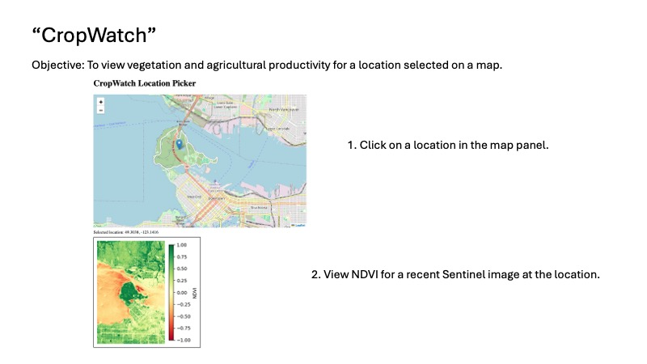

# cropwatch_rainview
Visualize vegetation health (NDVI) alongside precipitation tracking in tropical regions using satellite data, all deployed via AWS.

## Screenshot




## Python environment

First set up the Conda environment using the environment.yml file. `conda env create` should suffice. If the environment changes, then using `conda env update` should update it.

Activate the environment using `conda activate cropwatch_rainview`.

## Deploying the application

I have tested the following methods of deploying the application.

### Amazon Web Services

#### EC2 Instance with user data

1. Spin up an Amazon Linux instance using **at least t3.medium** or similar resources. (A t3.micro instance will not
create the Python environment.)
    - You do not need a key pair, since you can get into it using EC2 Instance Connect.
    - Security group must allow TCP traffic on port 8050.
    - User data is under the "Advanced Details" section.
```bash
#!/bin/bash
# Update and install prerequisites
yum update -y
yum install -y python3 git wget

# Set up Miniconda
mkdir -p /home/ec2-user/miniconda3
wget https://repo.anaconda.com/miniconda/Miniconda3-latest-Linux-x86_64.sh \
    -O /home/ec2-user/miniconda3/miniconda.sh
bash /home/ec2-user/miniconda3/miniconda.sh -b -u -p /home/ec2-user/miniconda3
rm /home/ec2-user/miniconda3/miniconda.sh
chown -R ec2-user:ec2-user /home/ec2-user/miniconda3

# Pre-accept Anaconda Terms of Service
su - ec2-user -c "/home/ec2-user/miniconda3/bin/conda tos accept"

# Clone the repository
su - ec2-user -c "git clone https://github.com/brandonwkerns/cropwatch_rainview.git"

# Create the Conda environment
su - ec2-user -c "/home/ec2-user/miniconda3/bin/conda env create -y -f /home/ec2-user/cropwatch_rainview/environment.yml"

# Start the application
su - ec2-user -c "nohup /home/ec2-user/miniconda3/envs/cropwatch_rainview/bin/python /home/ec2-user/cropwatch_rainview/app.py > /home/ec2-user/app.log 2>&1 &"
```
